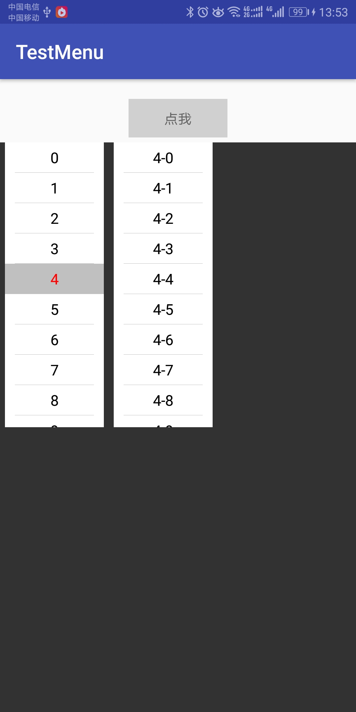
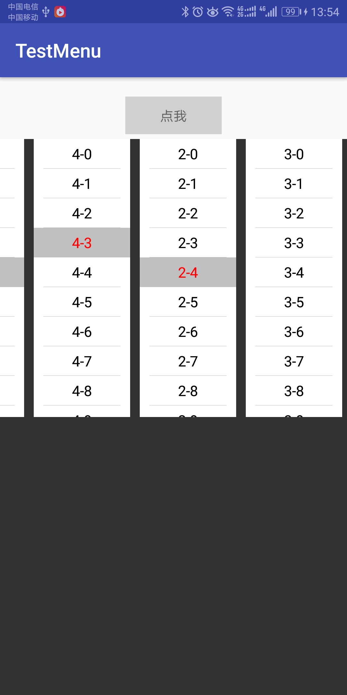

# SelectMenuView-Android
android下拉菜单

## 效果图
       

## 代理说明

```java
/**
 * 菜单块数
 * @param menuView 菜单view
 * @return 菜单块数
 */
int onMenuViewSection(SelectMenuView menuView);

/**
 * 菜单某块的个数
 * @param menuView 菜单view
 * @param section 第几块
 * @return 个数
 */
int onMenuViewRow(SelectMenuView menuView, int section);

/**
 * 获取数据
 * @param menuView 菜单view
 * @param section 菜单块
 * @param row 某块的位置
 * @return
 */
String onMenuViewContent(SelectMenuView menuView, int section, int row);

/**
 * 菜单选择
 * @param menuView 菜单view
 * @param section 菜单块
 * @param row 某块的位置
 *
 */
void onMenuViewSelect(SelectMenuView menuView, int section, int row);

/**
 * 菜单完成
 * @param menuView 菜单
 * @param selectIndexs 选中的位置
 */
void onMenuViewFinish(SelectMenuView menuView, List<Integer> selectIndexs);
```
